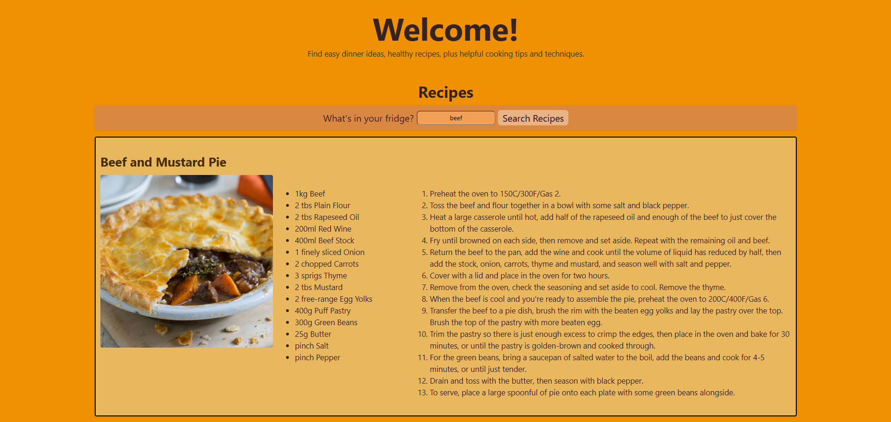

# Simple Recipe Website 

# Description
This website enables user to enter one ingredient from their fridge and find simple recipes

## How It's Made:
Tech used: 
- HTML
- CSS
- JavaScript
- API

## Lessons Learned:
- How to integrate API database into JS
- How to use innerText and HTML
- How to use split (), trim (), map (), slice() to clean up text from API call

## Notes
- Would like to commit better styling to website

#### API Used
https://www.themealdb.com/api.php 
